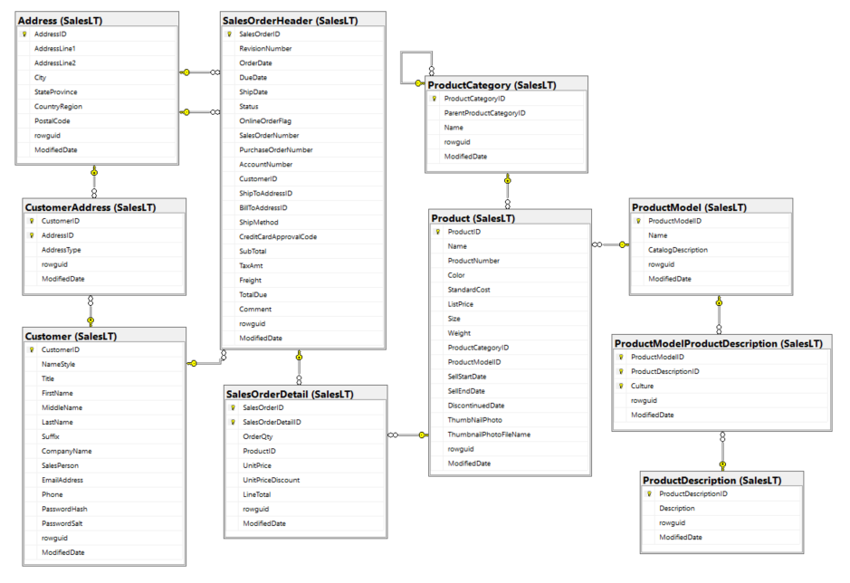
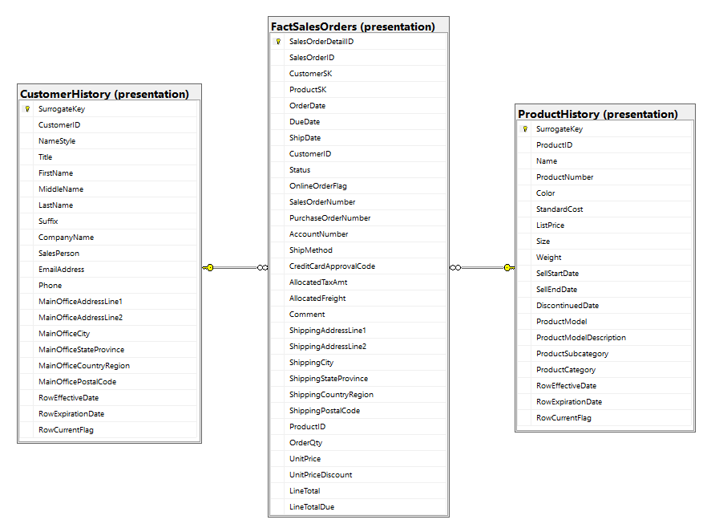
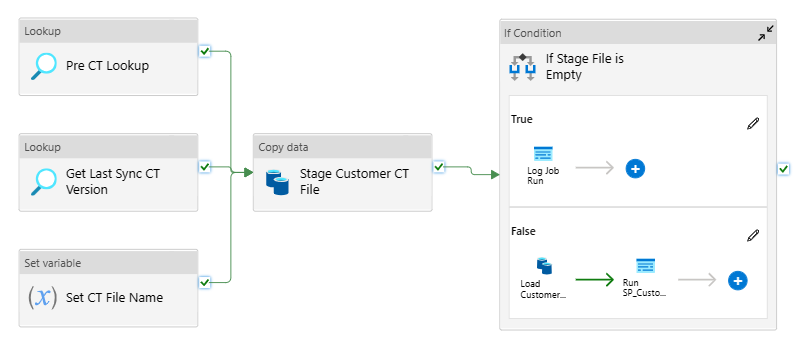
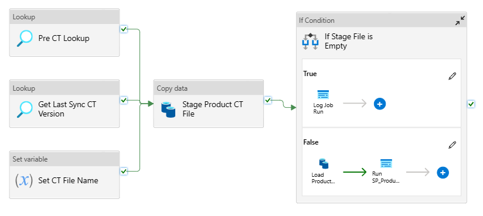
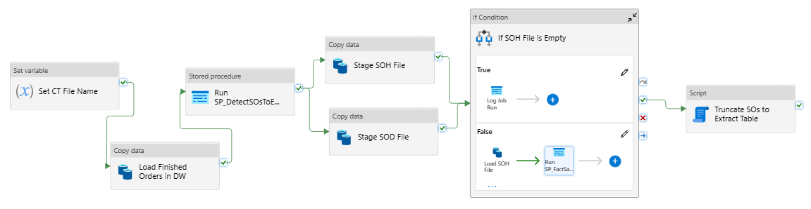

# AdventureWorksLT Data Warehouse

## Introduction

In the following project a DW for the AdventureWorksLT database is designed and implemented. 
The DW is stored in an Azure SQL Database and the ETL jobs are implemented using Change Tracking and 
Azure Data Factory.

## Operational Database Schema

The AdventureWorksLT database is an SQL Server sample database. It contains data about customers, products, 
and sales orders. The following image shows the schema of the database.

## Dimensional Model for the Sales Order Business Process

Sales orders are placed by customers, and each order is associated with multiple products. 

The sales order business process goes through the following states: 

- 1 = In process
- 2 = Approved
- 3 = Backordered 
- 4 = Rejected
- 5 = Shipped
- 6 = Cancelled

Rejected, shipped and cancelled are final states in this process. In this case, only orders 
that reach the shipped status should be loaded into the DW. 

To this end, the following database is implemented. The product and customer history tables
store the entire history of changes for the dimensional entities. The 
RowEffectiveDate and RowExpirationDate columns specify the timestamp
during which a row was valid. These history tables serve as the basis for building the 
dimension tables, which are implemented as view on top of its respective history table. 
These views apply the desired SCD logic for each column:
- SCD 0: keep the original value
- SCD 1: keep the most current value
- SCD 2: keep the history of changes
- SCD 3: keep the value fixed at a particular point in time.

This approach to building a dimension table gives us the following benefits:
- The dimensions are flexible in the type of SCD strategy, which allows the analysts to fit 
their data to their needs.
- The entire history of the data is kept.
- ETL jobs are simplified. An incremental load only requires the expiration of the current row
and insertion of a new one.
- Given that the dimension is a view, querying the table takes more time. However, in many
cases the DW serves only as a storing layer and data is often imported by users to another 
environment.

### Product Dimension

The following table describes the product dimension attributes and the columns from which data provides.

| Target   Column         | Data Type     | SCD Type | Description                                         | Source Column                         |
|-------------------------|---------------|----------|-----------------------------------------------------|---------------------------------------|
| SurrogateKey            | INT           | -        | Surrogate key                                       | -                                     |
| ProductID               | INT           | -        | Product primary key                                 | Product.ProductID                     |
| Name                    | NVARCHAR(50)  | 1        | Name of the product                                 | Product.Name                          |
| ProductNumber           | NVARCHAR(25)  | 1        | Unique product identification number                | Product.ProductNumber                 |
| Color                   | NVARCHAR(15)  | 1        | Product color                                       | Product.Color                         |
| StandardCost            | MONEY         | 2        | Standard cost of the product                        | Product.StandardCost                  |
| ListPrice               | MONEY         | 2        | Selling price                                       | Product.ListPrice                     |
| Size                    | NVARCHAR(5)   | 1        | Product size                                        | Product.Size                          |
| Weight                  | DECIMAL(8,2)  | 1        | Product weight                                      | Product Weight                        |
| SellStartDate           | DATETIME      | 0        | Date the product was available for   sale           | Product.SellStartDate                 |
| SellEndDate             | DATETIME      | 1        | Date the product was no longer   available for sale | Product.SellEndDate                   |
| DiscontinuedDate        | DATETIME      | 1        | Date the product was discontinued                   | Product.DiscontinuedDate              |
| ProductCategory         | NVARCHAR(50)  | 1        | Category description                                | ProductCategory.Name                  |
| ProductSubcategory      | NVARCHAR(50)  | 1        | Subcategory description                             | ProductCategory.Name                  |
| ProductModel            | NVARCHAR(50)  | 1        | Name of the product model                           | ProductModel.Name                     |
| ProductModelDescription | NVARCHAR(400) | 1        | Description of the product model                    | ProductDescription.EnglishDescription |
| RowEffectiveDate        | DATETIME      | -        | SCD 2 metadata                                      | -                                     |
| RowEndDate              | DATETIME      | -        | SCD 2 metadata                                      | -                                     |
| RowCurrentFlag          | BIT           | -        | SCD 2 metadata                                      | -                                     |
| RowDeletedFlag          | BIT           | -        | SCD 2 metadata                                      | -                                     |

### Customer Dimension

The following table describes the customer dimension attributes and the columns from which data provides.
A customer can have multiple addresses ('Main Office', 'Shipping', etc.). In this case, the main office
address data is included in the dimension.

| Target   Column        | Data Type     | SCD Type | Description                                                                                                                                 | Source Column         |
|------------------------|---------------|----------|---------------------------------------------------------------------------------------------------------------------------------------------|-----------------------|
| SurrogateKey           | LONG          | -        | Surrogate key                                                                                                                               | -                     |
| CustomerID             | INT           | -        | Customer primary key                                                                                                                        | Customer.CustomerID   |
| NameStyle              | BIT           | 1        | 0 = FirstName and LastName are   stored in western style (first name, last name) order.  1 = Eastern style (last name, first name)   order. | Customer.NameStyle    |
| Title                  | NVARCHAR(8)   | 1        | A courtesy title. For example, Mr.   or Ms.                                                                                                 | Customer.Title        |
| FirstName              | NVARCHAR(50)  | 1        | First name of the person                                                                                                                    | Customer.FirstName    |
| MiddleName             | NVARCHAR(50)  | 1        | Middle name or middle initial of the   person                                                                                               | Customer.MiddleName   |
| LastName               | NVARCHAR(50)  | 1        | Last name of the person                                                                                                                     | Customer.LastName     |
| Suffix                 | NVARCHAR(10)  | 1        | Surname suffix. For example, Sr. or Jr.                                                                                                     | Customer.Suffix       |
| CompanyName            | NVARCHAR(128) | 1        | Customer's organization                                                                                                                     | Customer.CompanyName  |
| EmailAddress           | NVARCHAR(50)  | 1        | Email address of the person                                                                                                                 | Customer.EmailAddress |
| Phone                  | NVARCHAR(25)  | 1        | Phone number of the person                                                                                                                  | Customer.Phone        |
| SalesPerson            | NVARCHAR(256) | 2        | Assigned sales person email                                                                                                                 | Customer.SalesPerson  |
| MainOfficeAddressLine1 | NVARCHAR(60)  | 2        | First street address line of the   main office                                                                                              | Address.AddressLine1  |
| MainOfficeAddressLine2 | NVARCHAR(60)  | 2        | Second street address line of the   main office                                                                                             | Address.AddressLine2  |
| MainOfficePostalCode   | NVARCHAR(15)  | 2        | Postal code for the street address   line of the main office                                                                                | Address.PostalCode    |
| MainOfficeCity         | NVARCHAR(30)  | 2        | Name of the city of the main office                                                                                                         | Address.City          |
| MainOfficeState        | NVARCHAR(50)  | 2        | Name of the state of the main office                                                                                                        | Address.StateProvince |
| MainOfficeCountry      | NVARCHAR(50)  | 2        | Name of the country of the main   office                                                                                                    | Address.CountryRegion |
| RowEffectiveDate       | DATETIME      | -        | SCD 2 metadata                                                                                                                              | -                     |
| RowEndDate             | DATETIME      | -        | SCD 2 metadata                                                                                                                              | -                     |
| RowCurrentFlag         | BIT           | -        | SCD 2 metadata                                                                                                                              | -                     |
| RowDeletedFlag         | BIT           | -        | SCD 2 metadata                                                                                                                              | -                     |

### Sales Order Lines Fact Table

A sales order is associated with two addresses (shipping and billing). In this case, only the shipping
address data is kept.

Given that sales orders follow a header-line pattern, header-level measurements like TaxAmt and Freight 
have to be allocated to the line level in order to keep a consistent grain for the fact table. This is done 
by distributing these measurements proportionally to LineSalesAmount/HeaderSalesAmount.

Finally, surrogate keys are added to the customer and product dimensions based on the order date.

The following table describes the sales orders fact table measures and the columns from which data provides.

| Target   Column        | Data Type     | Description                                                                                                       | Source Column                           |
|------------------------|---------------|-------------------------------------------------------------------------------------------------------------------|-----------------------------------------|
| SalesOrderDetailID     | LONG          | Primary key of SalesOrderHeader. This is also the PK for this table.                                              | SalesOrderDetail.SalesOrderLineID       |
| SalesOrderID           | LONG          | Primary key of SalesOrder                                                                                         | SalesOrderHeader.SalesOrderID           |
| CustomerSK             | INT           | Foreign key to the customer dimensional context at OrderDate                                                      | SalesOrderHeader.OrderDate              |
| ProductSK              | INT           | Foreign key to the product dimensional context at OrderDate                                                       | SalesOrderHeader.OrderDate              |
| OrderDate              | DATETIME      | Dates the sales order was   created                                                                               | SalesOrderHeader.OrderDate              |
| ShipDate               | DATETIME      | Date the order was shipped to   the customer                                                                      | SalesOrderHeader.ShipDate               |
| DueDate                | DATETIME      | Date the order is due to the   customer                                                                           | SalesOrderHeader.DueDate                |
| CustomerID             | INT           | Customer ID                                                                                                       | SalesOrderHeader.CustomerID             |
| Status                 | TINYINT       | Order current status. 1 = In   process; 2 = Approved; 3 = Backordered; 4 = Rejected; 5 = Shipped; 6 =   Cancelled | SalesOrderHeader.Status                 |
| OnlineOrderFlag        | BIT           | False = Order placed by sales   person. true = Order placed online by customer                                    | SalesOrderHeader.OnlineOrderFlag        |
| SalesOrderNumber       | NVARCHAR(23)  | Unique sales order   identification number                                                                        | SalesOrderHeader.SalesOrderNumber       |
| PurchaseOrderNumber    | NVARCHAR(25)  | Customer purchase order number   reference                                                                        | SalesOrderHeader.PurchaseOrderNumber    |
| AccountNumber          | NVARCHAR(15)  | Financial accounting number   reference                                                                           | SalesOrderHeader.AccountNumber          |
| ShipMethod             | NVARCHAR(50)  | Shipping method                                                                                                   | SalesOrderHeader.ShipMethod             |
| CreditCardApprovalCode | NVARCHAR(15)  | Approval code provided by the   credit card company                                                               | SalesOrderHeader.CreditCardApprovalCode |
| TaxAmtAllocated        | MONEY         | Tax amount allocated based on   the percentage the line total represents of the order total                       | SalesOrderHeader.TaxAmtAllocated        |
| FreightAlocated        | MONEY         | Shipping cost allocated based on   the percentage the line total represents of the order total                    | SalesOrderHeader.FreightAlocated        |
| Comment                | NVARCHAR(MAX) | Sales representative comments                                                                                     | SalesOrderHeader.Comment                |
| ShippingAddressLine1   | NVARCHAR(60)  | First street address line of the   shipping office                                                                | Address.ShippingAddressLine1            |
| ShippingAddressLine2   | NVARCHAR(60)  | Second street address line of   the shipping office                                                               | Address.ShippingAddressLine2            |
| ShippingPostalCode     | NVARCHAR(15)  | Postal code for the street   address line of the shipping office                                                  | Address.ShippingPostalCode              |
| ShippingCity           | NVARCHAR(30)  | Name of the city of the shipping   office                                                                         | Address.ShippingCity                    |
| ShippingState          | NVARCHAR(50)  | Name of the state of the   shipping office                                                                        | Address.ShippingState                   |
| ShippingCountry        | NVARCHAR(50)  | Name of the country of the   shipping office                                                                      | Address.ShippingCountry                 |
| ProductID              | INT           | Product ID                                                                                                        | SalesOrderDetail.ProductID              |
| OrderQty               | SMALLINT      | Quantity ordered per product                                                                                      | SalesOrderDetail.OrderQuantity          |
| UnitPrice              | MONEY         | Selling price of a single   product                                                                               | SalesOrderDetail.UnitPrice              |
| UnitPriceDiscount      | MONEY         | Discount amount (%)                                                                                               | SalesOrderDetail.UnitPriceDiscount      |
| LineTotal              | MONEY         | Per product subtotal. Computed   as UnitPrice * (1 - UnitPriceDiscount) * OrderQty                                | SalesOrderDetail.LineTotal              |
| LineTotalDue           | MONEY         | Total due from customer per   line. Computed as LineTotal + AllocatedTaxAmt + AllocatedFreight                    | SalesOrderDetail.LineTotalDue           |

## Incremental Load Jobs

A DW needs to capture the changes of the operational databases and keep track of these. 
To perform the incremental load of the DW, Change Tracking (CT) is used. 
CT is an SQL Server feature that records changes to the rows of a table. 
It can record INSERT, UPDATE, and DELETE operations, and can optionally record which columns have changed. 
CT does not store the history of changes, only the current version of each row can be retrieved by querying 
the source tables.

### Customer Incremental Load

To extract data changes of the customer dimension entities, CT is activated on the Customer, Address and CustomerAddress tables.
Customer inserts and deletes are identified by looking for inserts and deletes in the Customer table. 
Customer updates are identified by extracting all changes in the Customer, Address and CustomerAddress tables 
and associating the changes with its respective customer.
The process for extracting the customer CT updates can be found in the integration.CustomerCTUpdates function.

The CustomerIncrLoad pipeline has the following activities:

- **Set CT File Name**: sets the name with which the CT file will be saved in the staging area. 
- **Get Last Sync CT Version**: retrieves the metadata of the last execution of the pipeline (customer_sync).
- **Pre CT Lookup**: extracts the current CT version and timestamp. These are used to log the job execution 
if the CT file is empty.
- **Stage Customer CT File**: extracts the Customer CT Updates and saves it in Parquet format in ADLS.
- **If Stage File is Empty**: checks if the Customer CT Updates file is empty.
  - **TRUE**:
    - **Log Job Run**: logs the job execution using the CT version and extraction timestamp of the 
    **Pre CT Lookup** activity.
  - **FALSE**:
    - **Load Customer CT File**: load the Customer CT Updates file to the staging.CustomerCTChangesStaging table.
    - **Call SP_CustomerHistoryIncrementalLoad**: updates the Presentation.CustomerHistory table using the 
    contents of the Staging.CustomerCTChangesStaging table and logs the job execution.

### Product Incremental Load

To extract data changes of the product dimension entities, CT is activated on the Product, ProductCategory, ProductModel, ProductDescription and ProductModelProductDescription tables. 
Product inserts and deletes are identified by looking for inserts and deletes in the Product table. 
Product updates are identified by extracting all changes in the Product, ProductCategory, ProductModel, ProductDescription and ProductModelProductDescription tables and associating them to its respective product.
The process for constructing the product CT updates can be found in the integration.ProductCTUpdates function.

The ProductIncrLoad pipeline has the following activities:

- **Set CT File Name**: sets the name with which the CT file will be saved in the staging area. 
- **Get Last Sync CT Version**: retrieves the metadata of the last execution of the pipeline (product_sync).
- **Pre CT Lookup**: extracts the current CT version and timestamp. These are used to log the job execution 
if the CT file is empty.
- **Stage Product CT File**: extracts the Product CT Updates and saves it in Parquet format in ADLS.
- **If Stage File is Empty**: checks if the Product CT Updates file is empty.
  - **TRUE**:
    - **Log Job Run**: logs the job execution using the CT version and extraction timestamp of the 
    **Pre CT Lookup** activity.
  - **FALSE**:
    - **Load Product CT File**: loads the Product CT Updates file to the Staging.ProductCTChangesStaging table.
    - **Call SP_ProductHistoryIncrementalLoad**: updates the Presentation.ProductHistory table using the 
    contents of the Staging.ProductCTChangesStaging table and logs the job execution.

### Sales Orders Incremental Load

The SalesOrdersIncrLoad pipeline has the following activities:

- **Set CT File Name**: sets the name with which the CT file will be saved in the staging area. 
- **Load Finished Orders in DW**: loads the SalesOrderIDs for the orders in the Presentation.FactSalesOrder
table into the Integration.SalesOrdersToExtract table.
- **Run SP_DetectSOsToExtract**: compares the SalesOrderIDs in the Integration.SalesOrdersToExtract table 
to the finished orders in the operational database, and keeps only the finished orders that are in the 
operational DB but not in the DW.
- **Stage SOH File**: extracts the sales order headers for newly finished orders.
- **Stage SOD File**: extracts the sales order details for newly finished orders.
- **If SOH File is Empty**: checks if the SOH file is empty.
  - **TRUE**:
    - **Log Job Run**: logs the job execution using the current timestamp.
  - **FALSE**:
    - **Load SOH File**: loads SOH file into the Staging.SalesOrderHeaderStaging table.
    - **Load SOD File**: loads SOD file into the Staging.SalesOrderDetailStaging table.
    - **Call SP_ProductHistoryIncrementalLoad**: updates the Presentation.FactSalesOrders table using the 
    contents of the Staging.SalesOrderHeaderStaging and Staging.SalesOrderDetailStaging tables, and 
    logs the job execution.

## Repository Description

The contents of the repository are described in this section:

- **db-scripts/1_restore_database.sql**: script that sets the operational database in its initial state. It applies the following changes: deletes customers with no placed orders, and corrects the sales orders subtotal amounts. 
- **db-scripts/2_activate_change_tracking.sql**: script that activates change tracking on the operational database.
- **db-scripts/3_create_integration_schema.sql**: script that creates the integration scheme, which contains functions, views and SPs that support the incremental load jobs.
- **db-scripts/3_create_presentation_schema.sql**: script that creates the presentation schema, which contains the tables in the presentation area of the DW
- **db-scripts/3_create_staging_schema.sql**: script that creates the staging schema, which contains tables, functions and SPs that perform the incremental load jobs.
- **db-scripts/4_operations_day_x.sql**: scripts that contain DML statements to simulate the operations of the operational database.
- **adf-resources**: folder that contains the ADF resources in JSON format.
- **main.ipynb**: Powershell notebook that deploys the Azure resources, simulates the DB and DW operations day by day, and checks the ETL jobs. To run the notebook you need to:
  - install the powershell_kernel Python package: **pip install powershell_kernel**
  - set the powershell command to use: **python -m powershell_kernel.install --powershell-command [command]**
  - launch jupyter notebook: **jupyter notebook**
  - open the notebook and select the Powershell kernel

The main.ipynb notebook contains the results of a previous execution.
